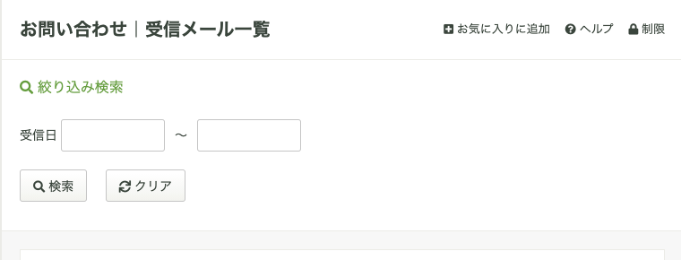
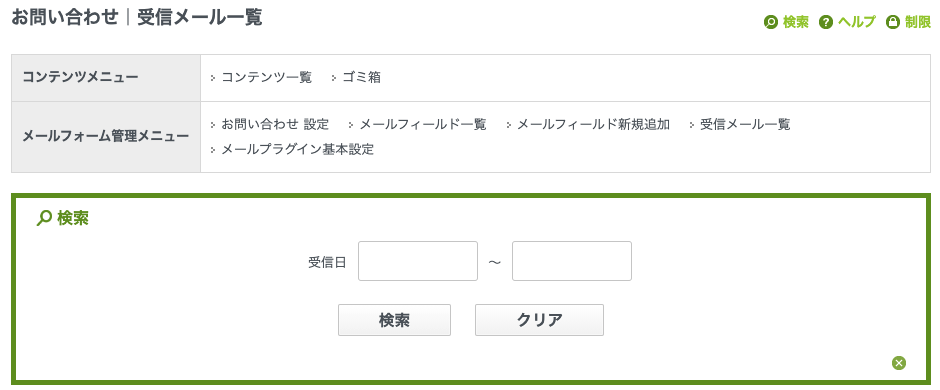

# SimpleSearchMailMessage

受信メール一覧画面に、受信日の期間指定による検索機能を追加できるbaserCMS専用のプラグインです。  

- 受信メール一覧画面で、受信日による受信メールの検索ができます。
- csvダウンロード時、受信日による検索結果内容に基づいたcsvデータがダウンロードできます。

	
	

[Summary: Wiki](https://github.com/materializing/SimpleSearchMailMessage/wiki)

## Setup, Installation
1. 圧縮ファイルを解凍後、BASERCMS/app/Plugin/SimpleSearchMailMessage に配置します。
2. 管理システムのプラグイン管理に入って、表示されている 受信メール日付検索プラグイン を有効化して下さい。

## Usage
- メールフォーム機能の受信メール一覧画面にアクセスします。
- 画面内の「検索」にアクセスすると検索フォームが表示されます。

### Notice
- メールフォームプラグインが有効な状態で利用してください。

## Dependency
- baserCMSのメールフォーム機能
- baserCMSの管理画面で利用される各種ライブラリ
    - jQuery
    - jQuery UI: Datepicker

## License
This software is released under the MIT License, see [LICENSE](https://choosealicense.com/licenses/mit/).

## Thanks, References

- [https://basercms.net/](https://basercms.net/)
- [https://wiki.basercms.net/](https://wiki.basercms.net/)
- [https://cakephp.jp](https://cakephp.jp)
- [Semantic Versioning 2.0.0](https://semver.org/lang/ja/)
